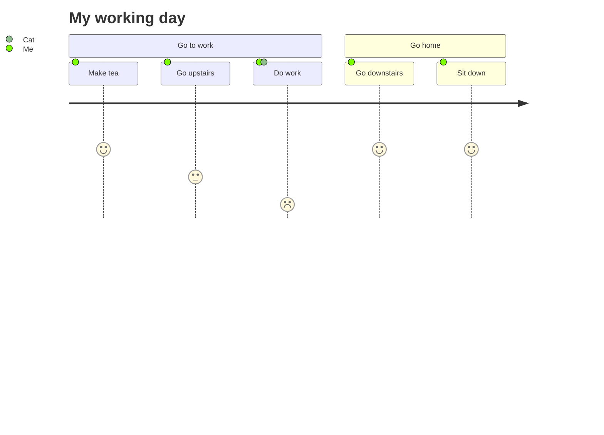

登录功能，相信大家做的项目里肯定有

那么登录怎么实现的，具体流程是怎样的呢？最近一个朋友面试遇到这题说答不上来，然后来问我，emmmm.....

我们都知道 http 是一种无连接无状态的协议，也就是说每一次请求都是独立的，服务器不能区分每一次的请求是不是来自同一个用户，所以就无法判断登录状态

为了解决这个问题，我们就需要一些处理方案，来记录登录状态

所以本文将从三个方面展开

- 第一章节主要介绍 调登录接口时，几种不同的登录方式都是怎样进行登录的
- 第二章节主要介绍 后续接口验证登录状态的几种方式和区别
- 第三章节主要介绍 单点登录，因为这个有点特殊，所以单独拎出来了

一起来了解一下吧

## 首次登录流程

先看一下几种不同的登录方式登录前后端要处理的流程，登录接口返回成功的流程统一看本文下一章节

### 账号密码登录

这个就不演示代码了，收集用户输入的用户名和密码，发送给后端和数据库比对验证，用户是否存在，密码是否正确，都 OK 就返回登录成功和用户信息等

有的会加一个图形验证码之类的，就是调接口，然后后端随机生成图形验证码，并存到 `session` 或者 `token` (取决于你项目采用的登录验证方式，在本文下一章节)，然后发送给前端展示

前端点登录的时候收集用户输入的验证码，和后端比对，都 OK 就返回登录成功和用户信息等

### 手机验证码登录、邮箱登录

这个也简单，就不演示代码了，比如手机验证码登录

前端点击发送验证码，把手机号传给后端，后端生成随机数，然后把号码和完整的短信内容(包括随机数)都发送给第三方短信平台(比如阿里、云片.....一大堆)

这里有的人是在第三方短信发送成功的回调里把手机号和随机数存到数据库
也有的人是生成好随机数后，就把号码和随机数存到数据库里，第三方返回的回调再 `update` 一下

比如发送的短信内容不符合规范，短信平台没钱了，短信平台异常等也有个记录日志在那里

用户收到短信后点登录，前端收集手机号和验证码传给后端和数据库进行对比，验证成功就返回登录成功和用户信息等

邮箱验证码和手机验证码逻辑基本都是一样的，用第三方邮箱平台，然后接收验证码的地方由手机号变为邮箱号

### 第三方账号快捷登录


首先第三方账号登录都需要去申请授权的

比如 QQ、微信

前端进入登录页面的时候调接口获取跳转到第三方登录页面的链接地址(最好不要前端这边写死)，这个地址上拼接了后端加密过后的签名、登录成功后的回跳地址(`redirect_uri`)等(具体可以看第三方登录的官方文档需要传一些什么)

QQ 登录地址示例

```
https://graph.qq.com/oauth2.0/show?which=Login&display=pc&response_type=code&client_id=101958498&redirect_uri=http%3A%2F%2Fniuj.uuuqwr.cn%2Findex.html%23%2Foauth_login%2Fqq&state=24c123db52d1136c7560638325fbdab4&scope=get_user_info,list_album,upload_pic
```

需要注意的是这个回调地址(`redirect_uri`)，得是在你的项目里的一个单独的专门的页面，就是专门接收登录成功后回调链接上带过来的参数操行一些操作，更改登录状态的，不能是你的项目的登录页面或者个人中心之类的

然后比如点击 QQ 登录的话，就直接跳转到后端返回的第三方登录链接，就是下面这样的


然后我们在这个页面登录的时候，第三方会以同样的方式生成签名并获取 URL 中的签名来对比，对比成功就说明可以登录，然后把验证通过的参数 code 等拼接到 URL 里携带的 `redirect_uri` 地址上再跳转过去

前端在这个回跳地址页面，拿到之后再传给后端，然后后端再调第三方的接口，拿到这个登录的用户的 `openId` 、 `unionId`，和数据库的对比，没有就注册用户，并保存 `openId` 、 `unionId`

然后就给前端返回登录成功状态，也有的需要再让你绑定手机号才给你登录成功，这里具体要看你的业务需求，前端再根据返回不同的状态进行登录成功还是绑定后机号等操作

比如微信登录，根据后端返回的 `redirect_uri` 和 `AppId` 等信息，在当前页面生成二维码，或者打开新标签页跳转到单独的扫码页面

比如在当前页面生成二维码，我这里使用的是 `vue-wxlogin`，先安装

```
npm install vue-wxlogin --save
```

然后使用

```js
<template>
  <wxlogin
    :appid="appid"
    :scope="scope"
    :redirect_uri="redirect_uri"
    self_redirect="false"
    theme="white"
  ></wxlogin>
</template>
<script>
import wxlogin from "vue-wxlogin";
export default {
  data(){
    return {
      appid: "wx989xxxxxxxxx",
      scope: "snsapi_login",
      redirect_uri: encodeURIComponent(
        "http://xxxxxx/index.html#/oauth_login/wx"
      )
    }
  }
}
</script>
```

生成二维码之后，第三方会开启轮询，如下


然后扫码登录后的流程就和 QQ 快捷登录后的流程基本上一模一样了

### App 扫码登录

首先需要生成二维码，我这里使用的是 `vue-qr`，先安装

```
npm install vue-qr --save
```

然后使用

```js
<template>
  <vue-qr
    :text="qrCode.url"
    :margin="5"
    colorDark="#222"
    colorLight="#fff"
    :logoSrc="qrCode.icon"
    :logoScale="0.2"
    :size="180"
  ></vue-qr>
</template>
<script>
import VueQr from "vue-qr";
export default {
  data(){
    return {
      qrCode:{
        url:'',
        icon:'',// 就是二维码中间的图片，可以不要
      }
    }
  },
  mounted(){
    this.getQrCodeInfo() // 调接口获取生成二维码所需的信息
  }
}
</script>
```

流程是这样的

- 进入页面首先获取生成二维码所需要的信息，调接口

- 然后后端生成比如 uuid 等，并设置设置过期时间存到缓存中，然后把信息 uuid 等返回给前端

- 前端拿到信息后，用这些信息作为上述代码中的 url，生成二维码，接着调用另一个接口把 uuid 传过去，并开启**轮循**、**或者长连接**，或者不调接口直接用 **WebSocket** 监听。具体使用哪一个看自己的业务需求或者和后端商量

- 然后手机端这边肯定是处于登录状态的，不然也没法扫码登录，然后 App 扫码，就会获取到二维码中的 uuid

- 接着手机端点登录之后，就把 uuid 和这个登录了手机端的用户账号信息，发送给后端

- 后端拿到登录的这个帐号信息，通过 WebSocket 发送给前端，就登录成功了。或者修改缓存中的值，比如把 uuid 存起来的时候是把 uuid 作为 key，但是没有值，然后轮询接口就是获取这个 uuid 的值，没登录之前获取的就是个空的，App 点登录之后，后端把拿到的用户信息等作为值赋给对应的 uuid，前端这边轮询查到的数据就不是空的了，就说明登录成功，然后后端再清掉这个缓存

### 指纹登录、刷脸登录、本机号码免密一键登录

这个都是用于移动端也就是 `iOS` 和 `Android`，而且都需要 `SDK`

因为我主要是搞 **Web** 端的，所以也没做过这个。个人理解大致流程应该是需要一个用户确认开通这些功能的页面，或者授权获取信息弹窗等方式，让用户授权

比如是本机号码免密一键登录，在接入 SDK 之后，通过 SDK 与运营商通信来获得用户手机号码


然后用户点击一键登录授权，通过网关取号对比，并返回对比结果实现一键登录

## 后续验证登录流程

常见的验证登录方式有以下两种

- Cookie + Session
- Token

不管是哪一种登录方式，验证原理目前都离不开上面的两种

续接上一章节，假设登录的请求，后端验证通过，之后流程如下

### Cookie + Session

**流程是这样的**

- 首次登录验证成功之后，后端会创建一个 Session 对象然后保存到缓存或者数据库里

- 然后在响应登录接口的响应头里，设置 Set-Cookie 字段，并把 SessionId 等信息写入进去，并设置过期时间，这些信息就是 Cookie，然后浏览器会保存这些 Cookie 信息

- 然后之后再发送请求的时候，如果当前域名有保存 Cookie 信息的话，浏览器会自动在请求头上添加 Cookie 字段，并带上保存的 Cookie 信息

- 然后后端接收到请求后，会把请求头中的 Cookie 信息提取出来和存在服务器的对应的 Session 信息作对比，如果一致就说明登录验证成功了，不需要再重复登录

比如咱们掘金就是通过这种方式登录的，这是掘金登录接口返回的，可以看到就有 SessionId 和一堆其他信息


**这种方式的缺点**

主要是 `CSRF攻击`：因为 Session 是基于 Cookie 识别的，如果 Cookie 被截获，然后人家就可以利用我们的 Cookie 信息跳过登录，直接进入登录状态，发起跨站伪造请求

然后是如果把 Session 存在服务器内存，没有存到数据库的话，还会有以下问题

- `多服务器无法共享`：比如我们登录的时候，，然后我们网站不同的资源可能存在不同的服务器，当我们请求另一台服务器时里面就没有 Session 信息，就会被认为没有登录过。所以导致这种方式的话，前端代码和后端代码都只能放在同一台服务器上

- `服务器压力大`：因为用户登录后的 Session 信息是存在内存里，如果用户量很大，服务器压力也会增大

### Token

**流程** 和上面 Session 差不多

- 首次登录验证成功之后，后端一般使用 `JWT` 将用户信息、签名等加密生成一串字符串，存到数据库并返回给前端

- 前端再存起来，存在 Cookie、SessionStorage、LocalStorage 都可以

- 之后再次请求时浏览器也不会默认携带，需要我们自己在请求拦截器里添加请求头，把 Token 信息带上

- 然后后端就拿到 Token 信息来查找数据库里有没有，如果有再执行查询数据库操作等返回前端请求的数据，因为设置了过期时间的话，时间到了 Redis 会自动就删掉数据库里的 Token，查询就不会有。当然也有人是开定时任务去删

也有的人不把 Token 存在数据库，而是生成 Token 的时候，把用户信息，过期时间等一起加密发给前端，之后再请求时，后端拿到 Token 就先解密，再查询解密出来的用户信息，如果查询到了并且也没有过期，就查询返回前端请求的数据

然后是，比如不允许多端登录，一边登录就要把另一边挤下线，意思就是一个账号只有允许一个 Token，然后其他地方登录，就会生成新的 Token 再存到数据库，就把之前的给替换掉了，那么用之前的 Token 登录的地方就会下线了

反之，如果需要允许多端登录，也就是说一个用户可以有多个 Token 了

**这种方式的特点**

- `更安全`：因为可以不用发送 Cookie 了，能够避免 CSRF 攻击。也不需要操作 Session 了
- `多服务器方便共享`：前后端代码文件等资源放在不同的服务器，请求时都能获取到正确的登录状态

## 单点登录(SSO)

简单说就是在一个应用注册的账号可以同时在多个应用上登陆

比如淘宝+天猫+支付宝+阿里巴巴...，这几个随便登陆哪一个，再打开其他几个的网站就会自动进入登录状态

它的登录方式就是本文第一章介绍的那些，后续验证方式也就是本文第二章介绍的那些，都介绍过了

关键一个点就是怎么把多个应用给联系起来？

还有使用 Cookie 的话，Cookie 本身有限制不能跨域，那还得需要解决这个问题

而且在同域下的不同域下的单点登陆也是有区别的，网上看过不少资料都说的不清不楚的，我也没做过这种多应用的单点登录，所以这里只总结了一下大致流程，自己记录一下，后面做一遍再完善吧

### 同域

比如百度(baidu.com)、百度网盘(pan.baidu.com)、百度贴吧(tieba.baidu.com)、百度地图(map.baidu.com)...

这种情况下实现单点登录

首先需要把 Cookie 设置给`顶级域`，这样子他下面所有的子域都可以访问他的 Cookie

然后通过 `Redis`、`Tomcat` 等，都可以把 Session 设置成在这几个域名里共享

这样就把几个应用联系起来了，然后其他流程和上面就差不多了

### 不同域

比如淘宝(taobao.com)、天猫(tmall.com)、支付宝(alipay.com)、阿里巴巴(1688.com)...

同域的情况下我们还可以通过顶级域共享 Cookie，可这种域名完全不同的情况下 Cookie 就不能共享了，那怎么办呢？

所以为了解决这个问题，我们就需要一个独立的能够统一管理或者共享这些状态信息的 `认证中心(CAS)`，也就是**SSO 登录系统**，或者可以理解为一个中转站

比如我们现在有两个站点：a.com 和 b.com 需要共享登录状态

**登录**

首先在没有登录的情况下，进入 a.com\/user 需要登录的页面时，发现没有登录时，就会重定向到认证中心，并且把自己的地址作为参数，比如

```
sso.com?redirect_uri=a.com/user
```

然后认证中心发现登录的请求中没有 Ticket 也就是用户没有登录，就转到登录页面，所有的登录都在认证中心里进行

然后用户输入信息提交登录申请后，认证中心会校验用户信息校验通过后，会生成一个授权码 Ticket，并将认证中心的登录状态写入 Cookie，再重写向到 先前的页面，并带上 Ticket

```
a.com/user?ticket=xxxxxxx
```

然后 a.com\/user 拿到 Ticket 后再向认证中心确认，授权码是不是有效，验证成功之后，服务器再把登录信息写入 Cookie，返回给前端保存起来，这时候 a.com 就有两个 Cookie 了，分别是自己和认证中心的登录状态，也就是登录成功了

为什么拿到 Ticket 后还要再向认证中心确认？ 因为如果不再次验证的话，比如我们直接在地址栏输入回调的地址，并且拼接上假的信息参数，不就直接认为登录了嘛，这当然不行，所以需要再验证一下

然后 b.com 也访问需要登录的页面，重写向到认证中心时，发现有之前登录过的 Cookie，所以直接下发 Ticket 给 b.com

然后 b.com 拿到 Ticket 后再向认证中心验证，验证成功就把登录信息写入 Cookie 返回给前端保存起来，这时候就是登录状态了，而不会进入到登录页面

**注销**

就是当一个应用上退出登录，其他所有共享登录的应用全都自动退出登录

比如 a.com 退出登录时，先清空自身的登录状态 Cookie，再携带 Ticket 请求认证中心的退出 api

然后认证中心验证 Ticket 有效之后，遍历下这个授权码下对应的所有应用，调用对应的退出 api

就完成了所有应用的退出

**单点登录的优缺点**

**优点**

- 用户体验好，不需要记住多个账号和密码
- 提高开发效率
- 方便管理



**缺点**

- 不利于重构，因为涉及到的系统多，要重构的话需要兼容所有系统，就很麻烦
- 存在安全隐患，毕竟只需要登录一次，所有授权的应用都可以直接访问，就可能导致一些信息泄露
